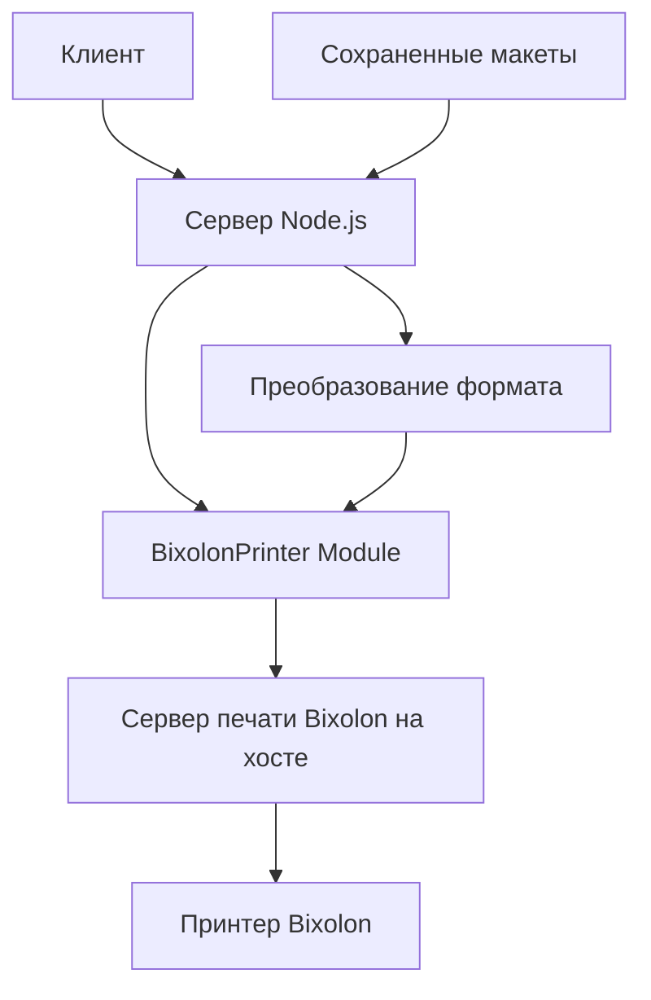

# Архитектурное решение для интеграции Bixolon печати в серверный код

## Обзор

Данный документ описывает архитектурное решение для интеграции функционала печати Bixolon в серверный код проекта. Решение учитывает, что проект работает в Docker-контейнере, а сервер печати установлен на хост-машине.

## Компоненты системы

### 1. Сервер печати Bixolon на хост-машине
- Порт: 18080 (по умолчанию, не подлежит изменению)
- Протокол: HTTP/HTTPS, WebSockets
- Адрес: `http://localhost:18080/WebPrintSDK/`

### 2. Docker-контейнер с приложением
- Доступ к серверу печати через `host.docker.internal` (для Windows/Mac) или IP-адрес хост-машины
- Взаимодействие через HTTP-запросы к серверу печати

### 3. Модуль интеграции Bixolon (server/bixolon-printer.js)
- Класс `BixolonPrinter` для взаимодействия с сервером печати
- Методы для отправки команд печати, проверки статуса и получения списка принтеров

## Архитектурное решение

### Доступ из контейнера к серверу печати на хосте

Для обеспечения доступа из Docker-контейнера к серверу печати на хост-машине будет использован следующий подход:

1. **Использование специального DNS-имени**:
   - В Linux: `host.docker.internal` (если доступно) или IP-адрес хост-машины
   - В Windows/Mac: `host.docker.internal`
   
2. **Конфигурация через переменные окружения**:
   - `BIXOLON_HOST`: адрес хост-машины (по умолчанию `host.docker.internal`)
   - `BIXOLON_PORT`: порт сервера печати (по умолчанию `18080`)
   - `BIXOLON_PRINTER_NAME`: логическое имя принтера (по умолчанию `Printer1`)

3. **Обновление docker-compose.yml**:
   - Добавление переменных окружения для настройки адреса сервера печати
   - При необходимости - настройка сетевых алиасов

### Модификации серверного кода

#### 1. Модуль интеграции Bixolon (server/bixolon-printer.js)

```javascript
const axios = require('axios');

/**
 * Класс для взаимодействия с принтером Bixolon через сервер печати
 */
class BixolonPrinter {
  constructor(host = 'host.docker.internal', port = 18080) {
    this.host = process.env.BIXOLON_HOST || host;
    this.port = process.env.BIXOLON_PORT || port;
    this.baseUrl = `http://${this.host}:${this.port}/WebPrintSDK`;
    this.printerName = process.env.BIXOLON_PRINTER_NAME || 'Printer1';
  }

 /**
   * Метод для отправки команды печати на сервер Bixolon
   * @param {string} printerName - Логическое имя принтера
   * @param {object} printData - Данные для печати в формате Bixolon
   * @returns {Promise<object>} Результат операции печати
   */
  async requestPrint(printerName, printData) {
    try {
      const response = await axios.post(`${this.baseUrl}/${printerName}`, printData, {
        headers: {
          'Content-Type': 'application/x-www-form-urlencoded'
        },
        timeout: 10000 // 10 секунд таймаут
      });

      return response.data;
    } catch (error) {
      console.error('Ошибка при отправке команды печати:', error.message);
      throw new Error(`Ошибка при печати: ${error.message}`);
    }
 }

  /**
   * Метод для проверки статуса принтера
   * @param {string} printerName - Логическое имя принтера
   * @param {string} requestId - ID запроса
   * @param {string} responseId - ID ответа
   * @returns {Promise<object>} Статус принтера
   */
  async checkStatus(printerName, requestId, responseId) {
    try {
      const inquiryData = JSON.stringify({
        RequestID: requestId,
        ResponseID: responseId,
        Timeout: 30
      });

      const response = await axios.post(`${this.baseUrl}/${printerName}/checkStatus`, inquiryData, {
        headers: {
          'Content-Type': 'application/x-www-form-urlencoded'
        },
        timeout: 10000
      });

      return response.data;
    } catch (error) {
      console.error('Ошибка при проверке статуса принтера:', error.message);
      throw new Error(`Ошибка при проверке статуса: ${error.message}`);
    }
  }

  /**
   * Метод для отправки данных этикетки на печать
   * @param {object} labelData - Данные этикетки в формате Bixolon
   * @returns {Promise<object>} Результат печати
   */
  async printLabel(labelData) {
    try {
      // Устанавливаем ID метки
      labelData.id = Date.now(); // Используем текущее время как ID
      
      // Отправляем команду печати
      const result = await this.requestPrint(this.printerName, JSON.stringify(labelData));
      
      // Если результат содержит RequestID и ResponseID, проверяем статус
      if (result.RequestID && result.ResponseID) {
        const statusResult = await this.checkStatus(
          this.printerName, 
          result.RequestID, 
          result.ResponseID
        );
        
        return statusResult;
      }
      
      return result;
    } catch (error) {
      console.error('Ошибка при печати этикетки:', error.message);
      throw error;
    }
  }

  /**
   * Метод для получения списка доступных принтеров
   * @returns {Promise<Array>} Список доступных принтеров
   */
  async getPrinters() {
    try {
      // Для получения списка принтеров отправляем запрос к корню API
      const response = await axios.get(this.baseUrl, {
        timeout: 5000
      });
      
      // В реальной реализации сервер Bixolon предоставляет API для получения списка принтеров
      // Здесь мы возвращаем базовую информацию
      return [{ name: this.printerName, status: 'ready' }];
    } catch (error) {
      console.error('Ошибка при получении списка принтеров:', error.message);
      throw new Error(`Ошибка при получении списка принтеров: ${error.message}`);
    }
  }
}

module.exports = BixolonPrinter;
```

#### 2. Обновление основного серверного файла (server.js)

Необходимо добавить в server.js:

1. Импорт модуля BixolonPrinter
2. Новые маршруты для печати этикеток
3. Методы преобразования макетов в формат Bixolon

```javascript
// В начале файла server.js
const BixolonPrinter = require('./bixolon/BixolonPrinter.js');
const bixolonPrinter = new BixolonPrinter();

// Новый маршрут для печати этикетки
app.post('/api/print-label', async (req, res) => {
  try {
    const { template, data } = req.body;

    if (!template) {
      return res.status(400).json({ error: 'Отсутствует имя шаблона' });
    }

    if (!data || typeof data !== 'object') {
      return res.status(400).json({ error: 'Данные должны быть объектом' });
    }

    // Загружаем макет из файла
    const filepath = join(LAYOUTS_DIR, `${template}.json`);

    if (!fs.existsSync(filepath)) {
      return res.status(404).json({ error: 'Макет не найден' });
    }

    const layoutData = JSON.parse(fs.readFileSync(filepath, 'utf8'));

    // Преобразуем макет в формат Bixolon
    const bixolonData = convertLayoutToBixolonFormat(layoutData, data);

    // Отправляем на печать
    const printResult = await bixolonPrinter.printLabel(bixolonData);

    res.json({ 
      message: 'Этикетка успешно отправлена на печать', 
      result: printResult 
    });
  } catch (error) {
    console.error('Ошибка при печати этикетки:', error);
    res.status(500).json({ error: `Ошибка сервера при печати этикетки: ${error.message}` });
  }
});

// Маршрут для получения списка доступных принтеров
app.get('/api/printers', async (req, res) => {
 try {
    const printers = await bixolonPrinter.getPrinters();
    res.json(printers);
  } catch (error) {
    console.error('Ошибка при получении списка принтеров:', error);
    res.status(500).json({ error: `Ошибка сервера при получении списка принтеров: ${error.message}` });
  }
});
```

## Обработка команд печати этикеток

### 1. Маршрут `/api/print-label`

Принимает:
- `template`: имя сохраненного макета
- `data`: объект с данными для замены переменных в макете

Возвращает:
- Результат операции печати от сервера Bixolon

### 2. Преобразование формата

Функция `convertLayoutToBixolonFormat` будет преобразовывать макеты, созданные в редакторе (на основе Fabric.js), в формат команд Bixolon, понятный серверу печати.

## Механизмы передачи данных из макетов в формат Bixolon

### 1. Преобразование объектов Fabric.js в команды Bixolon

Для преобразования макетов в формат Bixolon будет реализована функция `convertLayoutToBixolonFormat`, которая:

1. Анализирует объекты на холсте (текст, изображения, штрихкоды)
2. Преобразует их в соответствующие команды Bixolon
3. Заменяет переменные в тексте на значения из переданных данных
4. Учитывает размеры этикетки и DPI

### 2. Поддерживаемые элементы

- Текстовые объекты (с поддержкой шрифтов, размеров, стилей)
- Изображения
- Штрихкоды (1D и 2D)
- Геометрические фигуры

## Диаграмма взаимодействия



## Конфигурация Docker

### docker-compose.yml

```yaml
version: '3.8'

services:
  label-designer:
    build: .
    ports:
      - "${PORT:-3000}:3000"
    volumes:
      - ./layouts:/app/layouts
    environment:
      - PORT=${PORT:-3000}
      - BIXOLON_HOST=host.docker.internal
      - BIXOLON_PORT=18080
      - BIXOLON_PRINTER_NAME=Printer1
    env_file:
      - .env
    restart: unless-stopped
    networks:
      - label-network

networks:
  label-network:
    driver: bridge
```

## Безопасность и надежность

1. **Таймауты**: Все HTTP-запросы к серверу печати имеют установленные таймауты
2. **Обработка ошибок**: Все операции с принтером обернуты в try-catch блоки
3. **Логирование**: Все ошибки логируются для последующего анализа
4. **Проверка статуса**: После отправки команды на печать проверяется статус выполнения

## Масштабируемость

1. **Конфигурация через переменные окружения**: Позволяет легко изменять настройки под разные окружения
2. **Модульная архитектура**: Отдельный модуль для работы с Bixolon позволяет легко заменить или обновить реализацию
3. **Поддержка нескольких принтеров**: При необходимости можно расширить реализацию для работы с несколькими принтерами